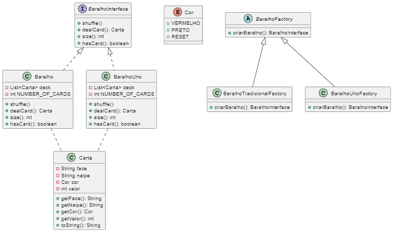

# Projeto de Baralhos com Padrões de Projeto

## Descrição do Problema

Este projeto tem como objetivo criar baralhos diferentes, utilizando padrões de projeto, para serem usados em futuros jogos de cartas como Uno, Blackjack, Poker, Buraco, entre outros. O foco desta implementação é fornecer a estrutura para criação de baralhos com regras específicas, sem a necessidade de codificar os jogos. Três baralhos foram implementados: o Baralho Tradicional, o Baralho de Uno, e o Baralho personalizado com base nas necessidades futuras.

## Padrões de Projeto Utilizados

### 1. **Factory Method**
- **Aplicação:**
  O padrão **Factory Method** foi utilizado para definir um método abstrato que cria os objetos do tipo `BaralhoInterface`. Esse padrão permite que as subclasses decidam qual baralho específico deve ser instanciado (ex: Baralho Tradicional ou Baralho Uno). Foi criada uma classe base abstrata `BaralhoFactory` com um método `criarBaralho()`, e duas subclasses concretas `BaralhoTradicionalFactory` e `BaralhoUnoFactory`, que implementam este método para instanciar os baralhos específicos.

- **Justificativa:**
  Este padrão foi escolhido para garantir que a criação de baralhos seja flexível e extensível. Caso seja necessário criar novos tipos de baralho no futuro (como baralhos personalizados para outros jogos), basta implementar uma nova fábrica sem alterar o código existente. O **Factory Method** é ideal aqui porque ele separa a lógica de criação do objeto da lógica de uso, garantindo que cada baralho possa ser criado de forma independente sem conhecimento de como ele será utilizado posteriormente.

## Solução do Problema

A solução adotada com o **Factory Method** permite uma abstração na criação de diferentes tipos de baralho. Isso resolve o problema de criar baralhos específicos para diferentes jogos, ao mesmo tempo que segue os princípios SOLID e GRASP, especialmente o princípio da **Responsabilidade Única** e o princípio **Aberto/Fechado**. Novos tipos de baralho podem ser adicionados no futuro sem alterar o código existente.

### Estrutura de Pastas

A organização modular dos pacotes, separando o comportamento dos baralhos (no pacote `baralho`) e a criação dos baralhos (no pacote `factory`), também facilita a manutenção e a expansão do código.

### Pontos Positivos da Abordagem

1. **Extensibilidade:** A adição de novos tipos de baralho pode ser feita sem modificar o código existente, apenas implementando novas fábricas.
2. **Responsabilidade Única:** Cada classe tem uma responsabilidade bem definida (ex: as fábricas são responsáveis pela criação dos baralhos, enquanto os baralhos são responsáveis pelas operações relacionadas às cartas).
3. **Aberto/Fechado:** A implementação está aberta para extensão (adição de novos tipos de baralho) e fechada para modificação (não é necessário alterar o código existente para adicionar novos baralhos).
4. **Flexibilidade para jogos futuros:** O design pode ser facilmente adaptado para adicionar regras específicas de cada jogo, utilizando o padrão **Strategy** para pontuação ou lógica do jogo.

## Conclusão

A solução apresentada cumpre os requisitos propostos e utiliza os padrões de projeto de maneira eficaz. Através da implementação do padrão **Factory Method**, foi possível criar uma arquitetura flexível e extensível para a criação de baralhos. A justificativa para a utilização deste padrão está na facilidade de manutenção e expansão, permitindo que novos tipos de baralho sejam adicionados sem modificar o código existente, e na separação clara das responsabilidades das classes.

